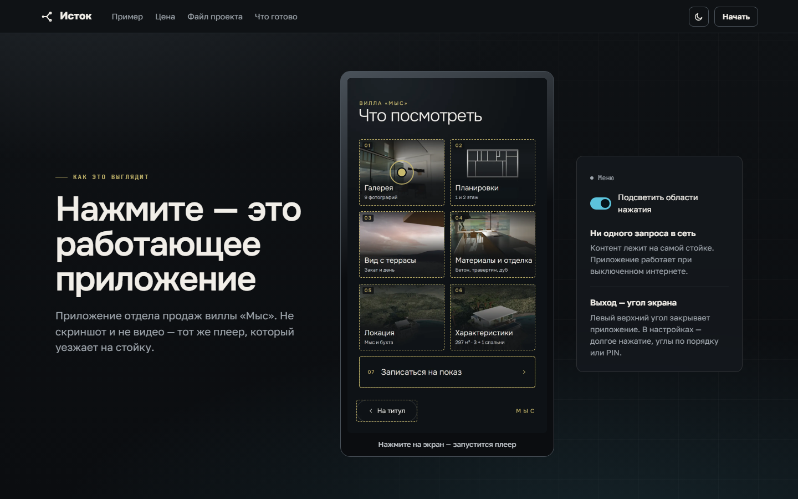
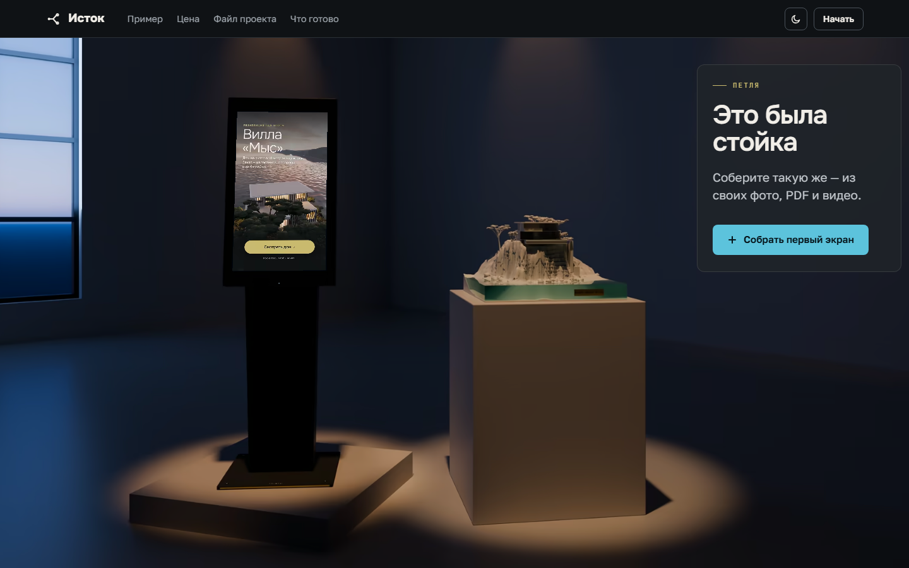
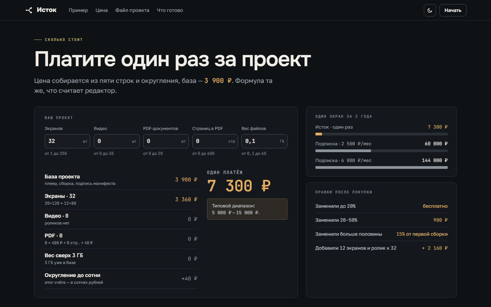
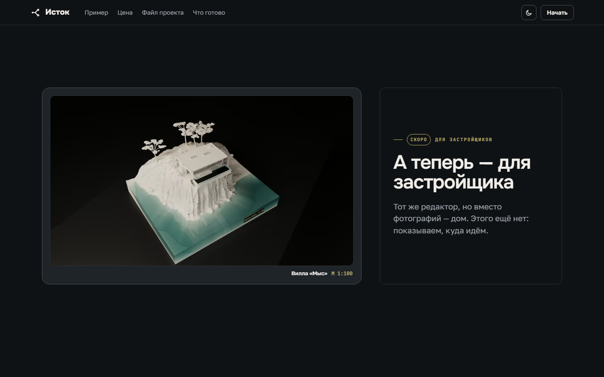
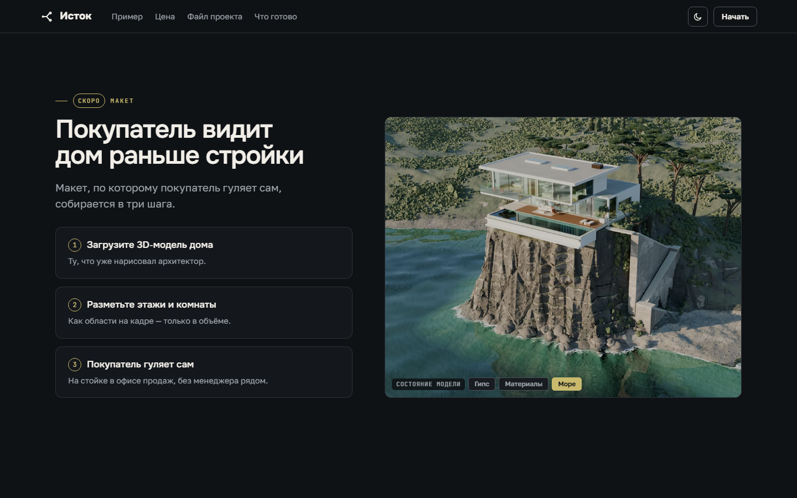
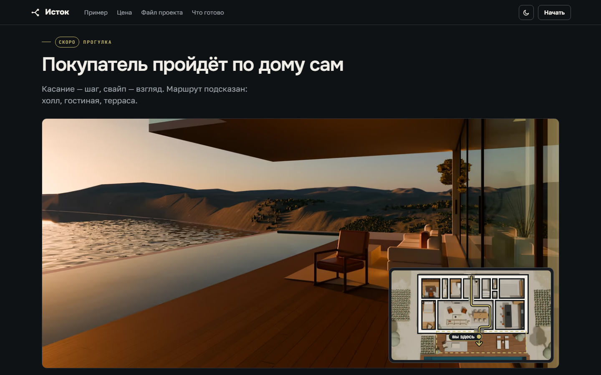

<picture>
  <source media="(prefers-color-scheme: dark)" srcset="images/istok-logo-dark.svg">
  
</picture>

# Исток

**Интерактивный стенд для музея или офиса продаж — без программиста.**

Вы приносите свои фотографии, PDF и видео, раскладываете их по папкам так, как
устроена экспозиция, и расставляете кнопки прямо по кадру. Получаете готовое
приложение для сенсорной стойки: оно работает без интернета и не требует
подрядчика, чтобы поменять в нём текст или фотографию.

**Страница Истока с живым примером: https://dotnotfact.github.io/istok-about/**

*Живой пример — демо-стенд «Вилла «Мыс»». Это не скриншот и не видео: на
странице Истока его можно потрогать — работает тот же плеер, который уезжает
на стойку.*

---

## Для кого

- **Музеи и выставки**, где нужен экран с экспозицией, а штатного разработчика
  нет и не будет. Стенд собирает тот, кто знает содержание: куратор,
  экскурсовод, сотрудник отдела.
- **Отделы продаж**, которым нужен стенд с проектом: галерея, планировки,
  материалы, запись на показ.

Обычно такой стенд заказывают студии: месяцы переписки, правки через
подрядчика и приложение, которое без него не поменять. Исток убирает
посредника.

## Как это выглядит

*Так стенд стоит в зале: сенсорная стойка и приложение, собранное из ваших
фото, PDF и видео.*

*Цена считается при вас и показывается в редакторе на каждое изменение.
Платите один раз за проект — подписки нет.*

## Как это устроено для человека

1. **Папка.** Складываете кадры, видео и PDF так, как они идут по экспозиции.
   Экраны, переходы и названия собираются из структуры папок.
2. **Разметка.** Ставите кнопки мышью прямо по кадру, смотрите превью,
   правите. Превью — это тот же плеер, который уедет на стойку.
3. **Показ заказчику.** Директор открывает стенд по ссылке без регистрации,
   оставляет замечания к конкретным экранам и нажимает «Утверждаю».
4. **Приложение.** Забираете готовое приложение и ставите его на стойку.

Редактор, превью и проверки ничего не стоят и не ограничены по числу
проектов. Деньги берутся один раз — когда приложение уезжает на стойку.

## Без обещаний: что есть, что делается, чего нет

### Работает

- **Дерево экранов из папки с материалами** — три дня ручной разметки
  превращаются в проверку готового дерева.
- **Пустой проект одного из трёх видов**: музейная экспозиция, выставочный
  стенд, офис продаж.
- **Работа без интернета.** Собранное приложение не делает ни одного сетевого
  запроса.
- **Дерево на 200+ экранов.** Раскладку считает сам редактор, узлы не
  таскаются мышью — структуру нельзя сломать случайным движением.
- **Превью — это и есть плеер.** Сюрприза «в превью было иначе» не будет.
- **Файл проекта переживёт редактор.** У файла есть номер версии, проект,
  собранный сегодня, откроют будущие версии.
- **Файлы остаются на вашем диске.** На сервер кадры уезжают только к сборке.
- **Проект хранится с историей версий** — открыли с другой машины и
  продолжили с того же места.
- **Совместная работа по ссылке.** Соавтор предлагает правку, владелец видит
  разницу и подтверждает.
- **Ссылка заказчику без регистрации** — замечания к экранам и «Утверждаю».
  Поправили экран после утверждения — оно перестаёт действовать, и это видно.
- **Документы для закупки**: коммерческое предложение со сроком цены, счёт и
  акт.
- **Правки считаются по разнице.** До 20% замен после оплаты — бесплатно,
  дальше по шкале.
- **Права до сборки** — четыре отдельных подтверждения: произведения, их
  фотографии, изображённые люди, дирекция музея.
- **Любое разрешение экрана.** Один проект едет и на 1366×768, и на 4K.
- **Светлая и тёмная тема** — и в редакторе, и в готовом приложении.
- **Докачка больших архивов** с места обрыва.
- **Статистика со стойки и отчёт музею за период** — какие экраны открывали и
  какие кнопки нажимали; то, что не открыли ни разу, выведено первым. Отчёт
  открывается в Excel.

### Делаем

- **Сборка на сервере с защитой от подмены.** Стойка проверяет подпись при
  запуске; пока не готова дорога, по которой кадры попадают на сервер, и
  обещать оплаченную сборку на сервере работающей мы не будем.
- **Быстрый запуск на старом компьютере** — осталось померить на настоящей
  стойке.
- **Видео под конкретную стойку** — перекодирование под её процессор, прогон на
  эталонной машине впереди.
- **Обновление стойки с флешки** — написано и проверено, прогон с настоящей
  флешкой на настоящей стойке впереди.

### Скоро

- Пересборка без повторной загрузки: на сервер уезжают только заменённые
  файлы.
- Автоматическая разметка кнопок — редактор предлагает области на кадре,
  решает человек.
- Сравнение периодов в отчёте: «до и после» правки экспозиции.
- Фотобудка: снимок, рамка, печать или QR-код.
- Работа с оборудованием: принтеры, сканер QR, RFID, датчик присутствия,
  терминал оплаты.
- Доступность и звук: озвучивание экранов, крупный шрифт, режим для
  слабовидящих.
- Сборка под Linux и Astra и подача в реестр российского ПО.

### Чего нет

- **Стойка — только Windows 10 и новее.** На Windows 7 и 8 приложение не
  работает и работать не будет.
- **Редактор — Chrome или Edge.** В Firefox и Safari папку с материалами
  придётся выбирать заново после перезагрузки страницы.
- **Одновременной правки одного экрана нет** — соавтор предлагает, владелец
  подтверждает.
- **Тяжёлые PDF готовятся долго** — документ на триста страниц обрабатывается
  несколько минут; мы предупреждаем об этом заранее.
- **Браузер не соберёт стенд тяжелее 2 ГиБ** — такие стенды собирает сервер.
- **Мобильного редактора нет.** С телефона — превью и статус; планшет от
  десяти дюймов уже работает.
- **Связи с 1С и другими системами нет** — содержимое стойки обновляется
  вручную.
- **Панорам 360° не будет.**
- **Магазина модулей не будет.**
- **Маршрутов посетителя и тепловой карты не будет** — это решение: стенд
  стоит в общественном месте, и следить за людьми он не должен.

## Куда мы идём: дом вместо фотографий

То, что ниже, — направление, а не функция. В продукте этого пока нет, и срока
у этого нет тоже.

Тот же редактор, но вместо фотографий — трёхмерная модель дома. Застройщик
загружает модель, которую уже нарисовал архитектор, размечает этажи и комнаты,
а покупатель гуляет по дому сам — на стойке в офисе продаж, без менеджера
рядом.

## Как попробовать

Страница Истока с живым демо-стендом «Вилла «Мыс»»:
**https://dotnotfact.github.io/istok-about/**

## Связаться

Telegram: **https://t.me/istok_kiosk**

Расскажите, что за экспозиция или проект и какие материалы уже есть:
фотографии, видео, буклеты в PDF. Этого хватает, чтобы сказать, сколько
получится экранов и что стоит доснять.
